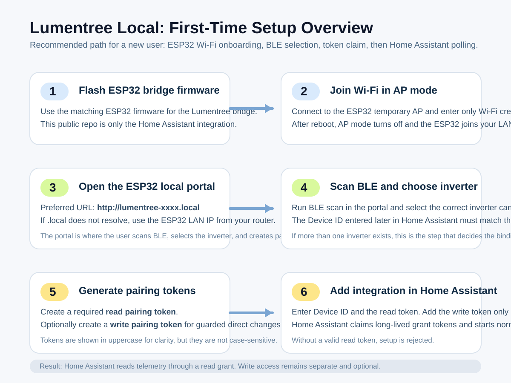
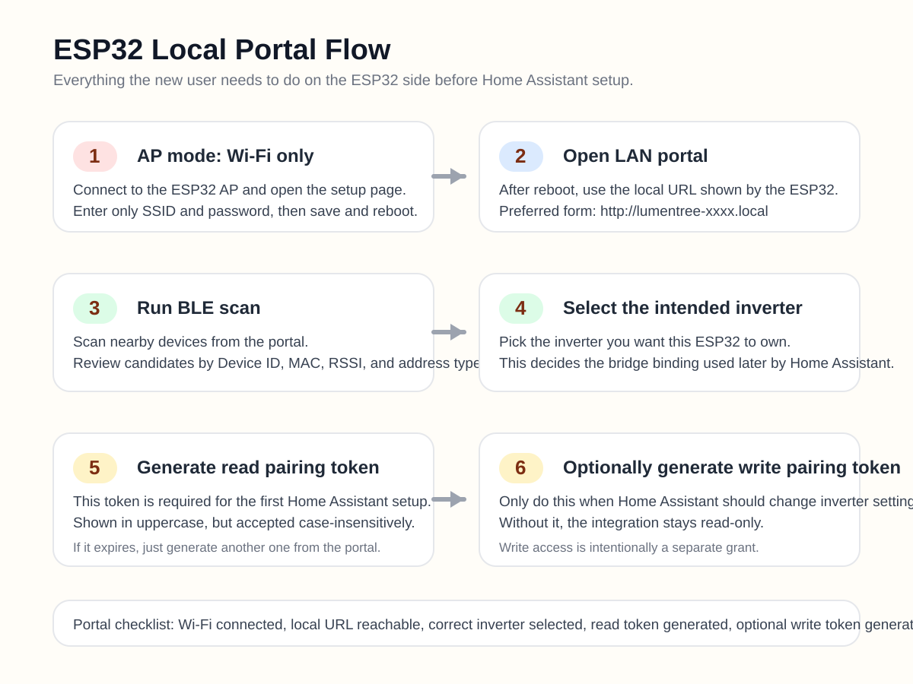
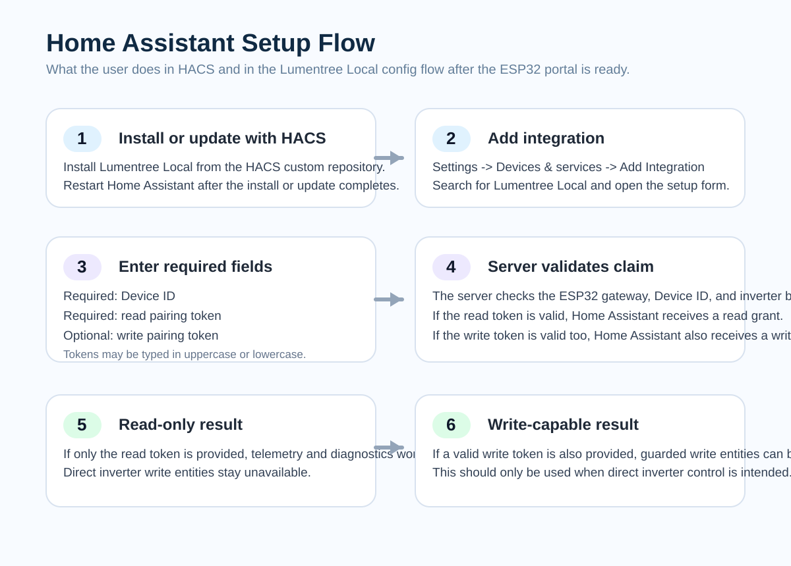
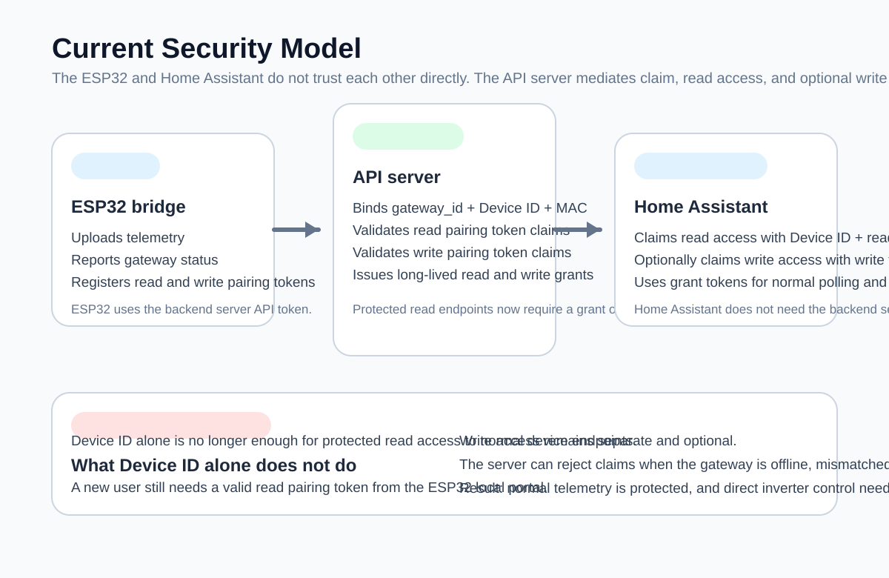

# Lumentree Local

Home Assistant custom integration for Lumentree inverter telemetry and guarded direct inverter control through an ESP32 BLE bridge.

This public repository contains only the Home Assistant integration and HACS-facing release surface.

<details open>
<summary><strong>English</strong></summary>

## What This Integration Does

`Lumentree Local` connects Home Assistant to a Lumentree inverter through:

1. an ESP32 device running the matching Lumentree bridge firmware
2. a local or hosted Lumentree API server
3. this Home Assistant integration

The integration provides:

- realtime inverter sensors
- energy sensors
- diagnostics and bridge status
- optional guarded direct inverter write entities when write access is explicitly granted

## Important Security Model

This integration no longer uses `Device ID` alone for first-time access.

Current onboarding requires:

- `Device ID`
- `read pairing token` from the ESP32 local portal
- optional `write pairing token` if Home Assistant should be allowed to change inverter settings

Important:

- `read pairing token` is required
- `write pairing token` is optional
- tokens are displayed in uppercase for readability
- tokens are **not case-sensitive**
- pairing tokens are short-lived onboarding secrets, not long-term API credentials

After Home Assistant claims access successfully:

- Home Assistant stores a long-lived `read grant token`
- Home Assistant optionally stores a long-lived `write grant token`
- normal telemetry polling uses the grant token, not the original pairing token

## Before You Start

You need all of the following:

- Home Assistant with HACS installed
- an ESP32 flashed with the matching Lumentree bridge firmware
- Wi-Fi credentials for the network that the ESP32 should join
- a working Lumentree API backend used by your ESP32 firmware
- your inverter `Device ID`

## Install With HACS

Add this repository as a custom repository in HACS:

```text
https://github.com/nlkcodenew/lumentreelocal
```

Category:

```text
Integration
```

Then:

1. Open `HACS`
2. Add the custom repository above if you have not already done so
3. Search for `Lumentree Local`
4. Install the integration
5. Restart Home Assistant



## First-Time Onboarding Flow

### Step 1: Flash The ESP32

Flash the correct Lumentree bridge firmware to your ESP32.

This public repository does not contain the firmware itself. It only contains the Home Assistant integration.

### Step 2: Join Wi-Fi Through ESP32 AP Mode

On first boot, the ESP32 should expose a temporary access point.

Typical flow:

1. Connect your phone or computer to the ESP32 AP
2. Open the ESP32 setup page
3. Enter only your Wi-Fi credentials
4. Save and let the ESP32 reboot

After Wi-Fi setup:

- AP mode turns off
- the ESP32 joins your normal LAN
- the ESP32 local portal becomes available on the local network

### Step 3: Open The ESP32 Local Portal

After the ESP32 joins Wi-Fi, open its local portal.

Preferred access:

```text
http://lumentree-xxxx.local
```

If `.local` does not resolve on your client, use one of these fallbacks:

- find the ESP32 IP address from your router DHCP client list
- use the IP shown by your admin tools or deployment environment

In the ESP32 portal you should be able to:

- scan nearby BLE devices
- select the intended inverter
- confirm the detected `Device ID`
- generate a `read pairing token`
- optionally generate a `write pairing token`



### Step 4: Scan BLE And Select The Correct Inverter

From the ESP32 portal:

1. Run BLE scan
2. Review the detected candidates
3. Select the inverter you want this ESP32 to bind to

If you have multiple inverters, this step matters.

The chosen binding is based on the inverter identity discovered by the ESP32 bridge. The `Device ID` you later enter in Home Assistant must match the inverter you selected.

### Step 5: Generate Pairing Tokens

From the ESP32 portal:

1. Generate a `read pairing token`
2. Optionally generate a `write pairing token`

Remember:

- both tokens are shown in uppercase
- both tokens are not case-sensitive
- both tokens expire
- if a token expires, generate a new one from the ESP32 portal

### Step 6: Add The Integration In Home Assistant

In Home Assistant:

```text
Settings -> Devices & services -> Add Integration -> Lumentree Local
```

Enter:

- `Device ID`
- `read pairing token`
- optional `write pairing token`

Behavior:

- if the read token is valid, Home Assistant claims a `read grant`
- if the write token is also valid, Home Assistant claims a `write grant`
- if the write token is omitted, the integration stays read-only



## Updating An Existing Installation

If you already use `Lumentree Local`:

1. Update the integration from HACS
2. Restart Home Assistant
3. Open the integration only if you need to change options or refresh write access

Normally you do **not** need to remove the integration just to update to a newer version.

## Read-Only vs Write-Capable Mode

### Read-Only Mode

If you add only:

- `Device ID`
- `read pairing token`

then Home Assistant can read telemetry and diagnostics, but cannot send guarded inverter write commands.

### Write-Capable Mode

If you also provide a valid `write pairing token`, Home Assistant may expose entities that change inverter settings directly.

Only enable write access if you understand the effect of those entities.

## What You Will See In Home Assistant

Typical entities include:

- PV power
- grid power
- load power
- battery SOC
- battery voltage and current
- inverter temperature
- daily, monthly, yearly, and total energy counters
- ESP32 uptime and status
- gateway pairing status

When write access is enabled, additional guarded entities may be available depending on backend support.

## Troubleshooting

### HACS Shows An Old Version

Try:

1. refresh HACS
2. restart Home Assistant
3. open the integration page again
4. redownload the integration from HACS if needed

### I Only See `Device ID` During Setup

You are almost certainly running an older integration build.

Update to the latest HACS release, then restart Home Assistant.

The current setup flow should ask for:

- `Device ID`
- `read pairing token`
- optional `write pairing token`

### Read Pairing Token Is Rejected

Check all of these:

- the ESP32 is online
- you selected the intended inverter in the ESP32 portal
- the `Device ID` entered in Home Assistant matches that inverter
- the token has not expired
- you generated the token from the same ESP32 that is bound to that inverter

Also note:

- tokens are not case-sensitive
- spaces before or after the token should be avoided

### Write Pairing Token Is Rejected

Check all of these:

- the ESP32 is online
- the `Device ID` is correct
- the write token has not expired
- the write token came from the same ESP32 bridge that currently owns the inverter binding

### `.local` Address Does Not Open

Some clients and networks handle mDNS better than others.

If `http://lumentree-xxxx.local` does not open:

- try another browser or device
- try from iPhone, iPad, macOS, or another mDNS-friendly client
- find the ESP32 IP in your router and open the portal by IP instead

### ESP32 Portal Opens But BLE Scan Finds Nothing

Possible causes:

- the inverter is too far away
- BLE conditions are noisy
- the inverter is not advertising at that moment
- the ESP32 needs another scan attempt

Try:

1. move the ESP32 closer
2. wait a few seconds
3. scan again

## FAQ

### Is The Pairing Token The Same As The Long-Term API Token?

No.

The pairing token is only for first-time claim or access elevation. Home Assistant later uses a long-lived grant token.

### Do I Need The Write Token?

No.

If you only want telemetry and diagnostics, use read access only.

### Is The Integration Safe If Someone Knows My Device ID?

The current protected flow is designed so `Device ID` alone is not enough for normal read access. First-time access requires a valid pairing token from the ESP32 portal.

### Does This Repository Include The ESP32 Firmware Or Full Server?

No.

This public repository is intentionally limited to the Home Assistant integration and HACS release surface.



## Repository Layout

- `custom_components/lumentreelocal/`: Home Assistant integration code
- `CHANGELOG.md`: public HACS release notes
- `hacs.json`: HACS metadata

## Version Source Of Truth

The HACS-visible version is defined in:

```text
custom_components/lumentreelocal/manifest.json
```

</details>

<details>
<summary><strong>Tiếng Việt</strong></summary>

## Tích Hợp Này Dùng Để Làm Gì

`Lumentree Local` kết nối Home Assistant với biến tần Lumentree thông qua:

1. một ESP32 chạy firmware bridge tương ứng
2. một Lumentree API server nội bộ hoặc public
3. custom integration này trong Home Assistant

Integration cung cấp:

- sensor thời gian thực của biến tần
- sensor điện năng
- chẩn đoán và trạng thái ESP32 bridge
- entity ghi lệnh có kiểm soát nếu được cấp quyền write rõ ràng

## Mô Hình Bảo Mật Hiện Tại

Flow hiện tại không còn dùng mỗi `Device ID` để cấp quyền lần đầu.

Lần add đầu tiên cần:

- `Device ID`
- `read pairing token` lấy từ web local của ESP32
- `write pairing token` nếu muốn cho Home Assistant quyền đổi cài đặt biến tần

Điểm quan trọng:

- `read pairing token` là bắt buộc
- `write pairing token` là tùy chọn
- token được hiển thị bằng chữ in hoa cho dễ nhìn
- token **không phân biệt chữ hoa chữ thường**
- pairing token chỉ là mã onboarding ngắn hạn, không phải credential dài hạn để dùng API mãi mãi

Sau khi Home Assistant claim thành công:

- Home Assistant lưu `read grant token` dài hạn hơn
- Home Assistant có thể lưu thêm `write grant token`
- quá trình polling dữ liệu về sau dùng grant token, không dùng lại pairing token ban đầu

## Cần Chuẩn Bị Gì Trước

Anh cần có:

- Home Assistant đã cài HACS
- một ESP32 đã flash đúng firmware bridge của hệ Lumentree
- Wi-Fi mà ESP32 sẽ kết nối vào
- Lumentree API backend đang hoạt động cho firmware ESP32
- `Device ID` của biến tần

## Cài Bằng HACS

Thêm repo này vào HACS dưới dạng custom repository:

```text
https://github.com/nlkcodenew/lumentreelocal
```

Category:

```text
Integration
```

Sau đó:

1. mở `HACS`
2. thêm custom repository ở trên nếu chưa có
3. tìm `Lumentree Local`
4. cài integration
5. restart Home Assistant


## Quy Trình Onboarding Lần Đầu

### Bước 1: Flash ESP32

Flash đúng firmware bridge Lumentree cho ESP32.

Repo public này không chứa firmware. Repo này chỉ chứa integration cho Home Assistant.

### Bước 2: Kết Nối Wi-Fi Bằng AP Mode

Khi boot lần đầu, ESP32 sẽ phát một access point tạm thời.

Flow thường là:

1. dùng điện thoại hoặc máy tính kết nối vào AP của ESP32
2. mở trang setup của ESP32
3. chỉ nhập Wi-Fi
4. lưu và chờ ESP32 reboot

Sau khi cấu hình Wi-Fi:

- AP mode sẽ tắt
- ESP32 vào mạng LAN bình thường
- web local của ESP32 sẽ chạy trên mạng nội bộ

### Bước 3: Mở Web Local Của ESP32

Sau khi ESP32 đã vào Wi-Fi, mở web local của nó.

Ưu tiên dùng:

```text
http://lumentree-xxxx.local
```

Nếu `.local` không resolve trên thiết bị của anh thì dùng cách dự phòng:

- xem IP ESP32 trong danh sách DHCP client của router
- dùng IP do hệ thống quản trị hoặc môi trường triển khai của anh cung cấp

Trong portal của ESP32 anh có thể:

- scan BLE xung quanh
- chọn đúng biến tần
- xác nhận `Device ID`
- tạo `read pairing token`
- tùy chọn tạo `write pairing token`


### Bước 4: Scan BLE Và Chọn Đúng Biến Tần

Trong web local của ESP32:

1. bấm scan BLE
2. xem danh sách candidate
3. chọn đúng biến tần cần ghép

Nếu anh có nhiều hơn một biến tần thì bước này rất quan trọng.

Việc bind sẽ dựa trên danh tính mà ESP32 nhìn thấy được từ BLE. `Device ID` nhập ở Home Assistant sau đó phải đúng với biến tần đã chọn.

### Bước 5: Tạo Pairing Token

Trong web local của ESP32:

1. tạo `read pairing token`
2. nếu muốn ghi lệnh từ HA thì tạo thêm `write pairing token`

Lưu ý:

- token được hiển thị bằng chữ in hoa
- token không phân biệt hoa thường
- token có thời hạn
- nếu hết hạn thì tạo lại token mới trên portal của ESP32

### Bước 6: Add Integration Trong Home Assistant

Trong Home Assistant:

```text
Settings -> Devices & services -> Add Integration -> Lumentree Local
```

Nhập:

- `Device ID`
- `read pairing token`
- `write pairing token` nếu muốn cấp quyền write

Hành vi:

- nếu read token hợp lệ, Home Assistant sẽ claim `read grant`
- nếu write token cũng hợp lệ, Home Assistant sẽ claim thêm `write grant`
- nếu bỏ trống write token thì integration sẽ chạy ở chế độ chỉ đọc


## Cập Nhật Bản Đang Dùng

Nếu anh đã cài `Lumentree Local` rồi:

1. update integration trong HACS
2. restart Home Assistant
3. chỉ mở lại integration nếu muốn đổi option hoặc cấp lại quyền write

Thông thường anh **không cần xóa integration** chỉ để update phiên bản mới.

## Chế Độ Chỉ Đọc Và Chế Độ Có Quyền Ghi

### Chỉ Đọc

Nếu chỉ nhập:

- `Device ID`
- `read pairing token`

thì Home Assistant sẽ đọc telemetry và diagnostics, nhưng không được gửi lệnh write có kiểm soát xuống biến tần.

### Có Quyền Ghi

Nếu nhập thêm `write pairing token` hợp lệ thì Home Assistant có thể hiện thêm các entity thay đổi cài đặt biến tần trực tiếp.

Chỉ bật quyền write khi anh thực sự hiểu tác động của các entity đó.

## Anh Sẽ Thấy Gì Trong Home Assistant

Các entity điển hình gồm:

- PV power
- grid power
- load power
- battery SOC
- battery voltage và current
- nhiệt độ biến tần
- các sensor điện năng ngày, tháng, năm, tổng
- uptime và trạng thái ESP32
- trạng thái pairing của gateway

Khi quyền write được bật, các entity ghi lệnh có kiểm soát có thể xuất hiện thêm tùy backend hỗ trợ.

## Xử Lý Sự Cố

### HACS Vẫn Hiện Bản Cũ

Thử lần lượt:

1. refresh HACS
2. restart Home Assistant
3. mở lại trang integration
4. nếu cần thì redownload integration từ HACS

### Form Add Integration Chỉ Có `Device ID`

Gần như chắc chắn anh đang chạy bản integration cũ.

Hãy update lên bản HACS mới nhất rồi restart Home Assistant.

Form hiện tại đúng phải hỏi:

- `Device ID`
- `read pairing token`
- `write pairing token` tùy chọn

### Read Pairing Token Bị Báo Sai

Kiểm tra lần lượt:

- ESP32 đang online
- anh đã chọn đúng biến tần trong portal ESP32
- `Device ID` nhập trong Home Assistant đúng với biến tần đó
- token chưa hết hạn
- token được tạo từ đúng ESP32 đang bind với biến tần đó

Lưu ý thêm:

- token không phân biệt hoa thường
- tránh thừa khoảng trắng đầu hoặc cuối

### Write Pairing Token Bị Báo Sai

Kiểm tra:

- ESP32 đang online
- `Device ID` đúng
- write token chưa hết hạn
- write token được tạo từ đúng ESP32 bridge hiện đang sở hữu binding của biến tần

### Không Vào Được Địa Chỉ `.local`

Khả năng hỗ trợ mDNS khác nhau tùy thiết bị và mạng.

Nếu `http://lumentree-xxxx.local` không mở được:

- thử bằng browser hoặc thiết bị khác
- thử iPhone, iPad, macOS hoặc client hỗ trợ mDNS tốt hơn
- xem IP ESP32 trong router rồi mở portal bằng IP

### Portal ESP32 Mở Được Nhưng Scan BLE Không Ra Gì

Nguyên nhân có thể là:

- ESP32 ở quá xa biến tần
- môi trường BLE nhiễu
- biến tần lúc đó chưa quảng bá phù hợp
- cần scan lại thêm một lần nữa

Thử:

1. đưa ESP32 lại gần hơn
2. chờ vài giây
3. scan lại

## Câu Hỏi Thường Gặp

### Pairing Token Có Phải API Token Dùng Lâu Dài Không

Không.

Pairing token chỉ dùng cho bước claim ban đầu hoặc nâng quyền. Sau đó Home Assistant sẽ dùng grant token dài hạn hơn.

### Có Bắt Buộc Phải Có Write Token Không

Không.

Nếu anh chỉ muốn đọc telemetry và diagnostics thì chỉ cần quyền read.

### Chỉ Biết `Device ID` Thì Có Đọc Được Dữ Liệu Không

Flow bảo vệ hiện tại được thiết kế để `Device ID` một mình không đủ cho quyền đọc thông thường. Bước truy cập lần đầu cần pairing token hợp lệ từ portal của ESP32.

### Repo Này Có Chứa Firmware ESP32 Và Full Server Không

Không.

Repo public này cố ý chỉ chứa integration Home Assistant và bề mặt release cho HACS.


## Cấu Trúc Repo

- `custom_components/lumentreelocal/`: mã integration cho Home Assistant
- `CHANGELOG.md`: release notes public cho HACS
- `hacs.json`: metadata cho HACS

## Nơi Quy Định Phiên Bản

Phiên bản mà HACS nhìn thấy được lấy từ:

```text
custom_components/lumentreelocal/manifest.json
```

</details>
